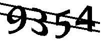

## Captcha Recognition for BKXK in Xiamen University

This repository serves as a recognizer of captchas in http://bkxk.xmu.edu.cn/xsxk/login.html. You can use the trained model to get results directly in one command, or follow this intruction to train the model yourself.

It can recognize captchas like following examples. With default trained model, the recognition rate can reach 99.99%.

### Prerequests

This project is written in Python 3.5, using PyCharm 2017.2.1, you need the following packages to run it:
- [Tesserocr 2.2.2]
- [TensorFlow]
- Others like Numpy, Image, Requests, etc.

Both tested on Windows 10 1703 and Ubuntu 17.04, make sure you install these packages first.

[Tesserocr 2.2.2]:https://pypi.python.org/pypi/tesserocr
[TensorFlow]:https://www.tensorflow.org/

### Use the default model

You can use this project out of box, and get recognition results in only one command with trained models offered by smartjinyu.

Just call
 
 
    Import ocrCaptcha
    reuslt = ocrRawCaptcha(Image)

The parameter is an Image object of a single captcha, it will return a str object containing reconition results. Refer to `downloadCaptchas.py` about how to get captchas from [the website]. The following are a simple example:

In most  situations, the default model should suffice for use. I used more than 8w samples in each label (9 labels in total) to train the model. In my test, the reconition rate can reach 99.99%.

[the website]:http://bkxk.xmu.edu.cn/xsxk/login.html

### Train the model yourself

If you want to train the model yourself, please follow these steps:

#### 1. Download labeled data:

    Python ./downloadCaptchas.py

Run `downloadCaptchas.py` to get labeled training examples from the website. The script will download captchas, remove the intefering line, split  characters, then use Tesseract to recognize them. In my test, Tesseract will give about 53.5% recognition rate for one captcha. After that, the script will try to login to the website using recognition results, and save the captcha with labels to disk if succeed.

#### 2. Split download captchas into single characters

    Python ./processImg.py

Run `processImg.py`, it will split downloaded results into images with single character. In default settings, the ratio of training set and validation set will be 4:1.

Be cautious that a large amount of small files may run out of your disk easily.

#### 3. Convert labeled data into TFRecords

    Python ./build_tfrecords.py
    

Run `build_tfrecords.py`. It will convert labeled data from above steps into TFRecords files, which is the standard format for TensorFlow.

#### 4. Train and save TensorFlow model

    Python ./train_models.py

Run `train_models.py`. This script will train a TensorFlow model using `softmax` method and save it to disk. The training time depends on your hardware and the size of your training set.

#### 5. Use it!

Congratulations! You have successfully trained your own model. Use it like the default model mentioned above. You can modify `downloadCaptchas.py` to estimate your new model's recognition rate.

### Others

This is just a simple example to recognize captchas. If you have any advice or complaints, feel free to contact me. During development, I refer to some examples in TensorFlow repository.

You can see [my blog] for other details.

[my blog]:https://smartjinyu.com/

### License

    Copyright 2017 smartjinyu

    Licensed under the Apache License, Version 2.0 (the "License");
    you may not use this file except in compliance with the License.
    You may obtain a copy of the License at

        http://www.apache.org/licenses/LICENSE-2.0

    Unless required by applicable law or agreed to in writing, software
    distributed under the License is distributed on an "AS IS" BASIS,
    WITHOUT WARRANTIES OR CONDITIONS OF ANY KIND, either express or implied.
    See the License for the specific language governing permissions and
    limitations under the License.

Notes: Some dependent packages may use different licenses. 